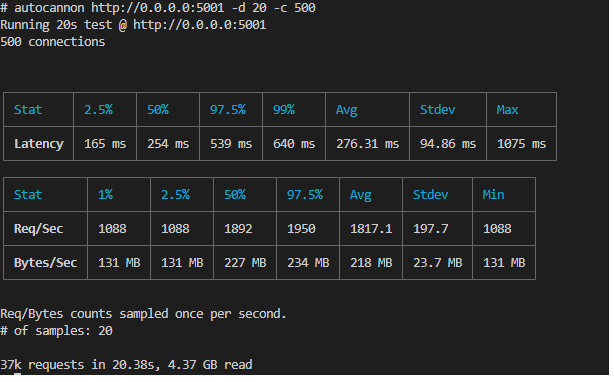
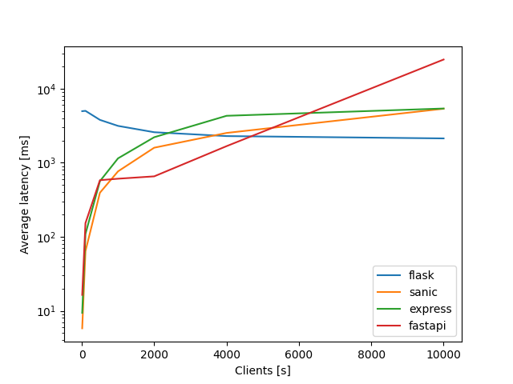
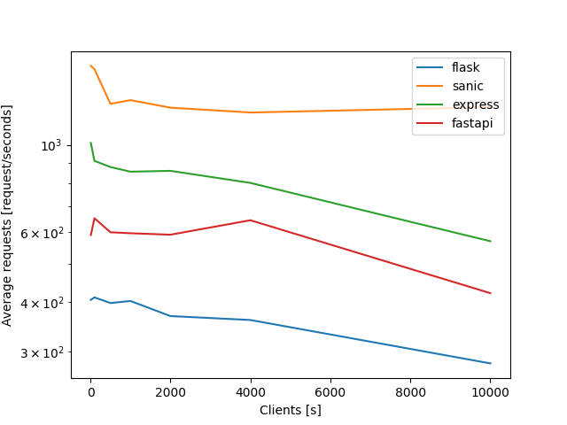
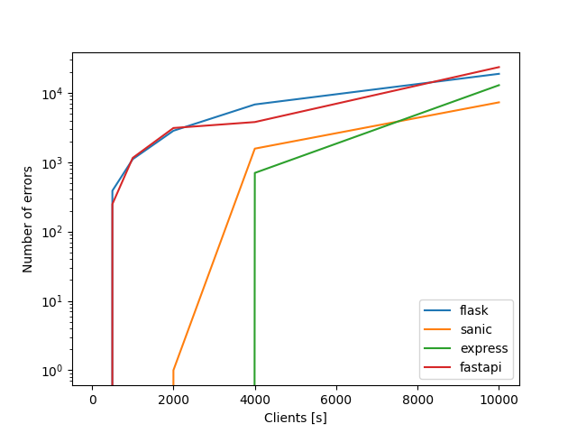

# Backends_performance_testing

Here we study the performance of Flask, Sanic, FastAPI and Express. To do this, docker-compose is used so that it is easy to play with the repository and reproduce the results. To measure the performance of each backend, autocannon is used to make requests, which allows controlling the number of connections that are established with each server. You must to install docker and docker compose.

Each server has the same route to test, e.g for Flask: 

```python
@app.route('/', methods = ['GET'])
def test():
    return {"result":"Hello world!"*10000}
```    

To run all the servers you must to use the next command:

```docker
docker-compose up
```
- Sanic server runs on port 5001

- Flask server runs on port 5000

- Express server runs on port 3000

- FastAPI server runs on port 5002

The container named "autocannon" will wait for 10 seconds and begin to make the test. You can change the test values in the script "autocannon/test_performance.py". This script will create a folder named "test_output" with all the .json files results for each test.

With the script "process_result.py", you can plot some figures from those tests.

If you want to perform a test on your own, you can enter the "autocannon" container and execute the commands. To create the Docker image, you can run the following command:

```docker
docker build -t autocannon -f Dockerfile_autocannon .
```

After you execute the container, you can run the following command to open the container prompt:

```docker
docker run -it --network host autocannon sh
```

This will open the container prompt, and you can execute your customized "autocannon" commands.



Some of the performance results are next

#### Average latency vs number of clients



#### Average request vs number of clients


#### Error number vs number of clients


The are a lot of other metrics to compare. Use this repo code as you wish.

